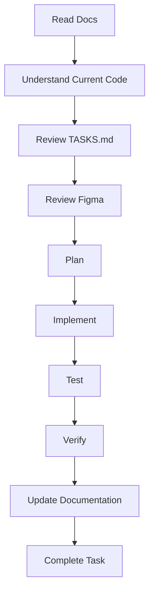

# Sentiora AI Prompt Guide

## Project Context
**Sentiora** is a memory-oriented web application designed to capture, index, and retrieve user content from webpages, PDFs, and YouTube.
* **Product Vision**: A private, intelligent, and context-aware second brain.
* **Architecture**: Clean Architecture, modular services, message-passing Chrome Extension, and background RQ workers.
* **Tech Stack**:
  * **Backend**: Python 3.12+, FastAPI, PostgreSQL (pgvector), SQLAlchemy, Alembic, RQ, Redis, OpenAI SDK.
  * **Frontend**: React, Vite, TypeScript, Tailwind CSS, React Router.
  * **Extension**: Chrome Extension (Manifest V3), React, TypeScript.
* **Repository Structure**: Monorepo split into `backend/`, `frontend/`, `extension/`, and `shared/` directories.
* **Current Phase**: Refer to `TASKS.md` for the latest active development phase.

---

## Golden Rules
When writing or reviewing code for Sentiora, AI agents **must**:
1. **Read documentation before coding**: Never skip canonical documents in the `docs/` folder.
2. **Treat documentation as the source of truth**: If in doubt, refer back to the specifications.
3. **Never invent architecture**: Follow established patterns (e.g., repository pattern, dependency injection).
4. **Never change APIs without checking docs**: Ensure all endpoints align with the locked API Specification.
5. **Never modify database schema unless required**: Migrations must follow the Database Schema Design document strictly.
6. **Maintain consistency**: Conform to existing naming conventions and style guides.
7. **Never break existing code**: Preserve backwards compatibility unless a breaking change is explicitly instructed and reviewed.
8. **Avoid duplicate implementations**: Reuse existing components, hooks, utilities, and services.
9. **Write production-ready code**: No placeholders, no `console.log` leftovers, no dead code.
10. **Follow clean architecture**: Keep route handlers thin; push business logic into services.
11. **Use type safety**: Enforce TypeScript strictness and Python type hints (`mypy`).
12. **Add comments only where useful**: Document module intent and public APIs, avoid obvious line-by-line comments.
13. **Keep files modular**: Ensure modules are self-contained and loosely coupled.

---

## Required Reading Before Coding
Before generating any implementation code, inspect the following resources:
* `README.md`
* `docs/01_PRD_v2.1_FINAL.pdf` (PRD)
* `docs/02_SRS_v1.0.pdf` (SRS)
* `docs/04_Technical_Specification_v1.2.pdf` (Technical Specification)
* `docs/07_Development_Implementation_Plan.pdf` (Implementation Plan)
* `docs/08_UIUX_Specification_v1.0_FINAL.pdf` (UI/UX Specification)
* `docs/TASKS.md` (Current Progress)
* Existing backend (`backend/app/`)
* Existing frontend (`frontend/src/`)
* Database models (`backend/app/models/`)
* API routes (`backend/app/api/`)
* The current branch and recent commits

---

## Before Writing Code
* **Understand the current implementation**: Contextualize how the new feature fits into the existing system.
* **Identify existing patterns**: Observe how similar features have been built.
* **Reuse components**: Search for shared UI components or backend utilities before building from scratch.
* **Check naming conventions**: Validate PascalCase for components, snake_case for Python, kebab-case for routes.
* **Understand folder structure**: Ensure files are placed in their proper architectural layer.
* **Identify dependencies**: Resolve any required library or module dependencies up front.

---

## During Implementation
* **Think step-by-step**: Outline the logic internally before dumping code.
* **Implement one feature at a time**: Do not bundle unrelated features into a single prompt session.
* **Avoid touching unrelated files**: Keep modifications scoped strictly to the requested feature.
* **Keep commits focused**: Group logical changes together.
* **Maintain backward compatibility**: Protect existing functionality.

---

## Testing Checklist
Every implementation must include or pass:
- [ ] Compilation (no build errors)
- [ ] Linting (`eslint`, `ruff`)
- [ ] Type checking (`tsc`, `mypy`)
- [ ] Backend startup (`uvicorn` runs without error)
- [ ] Frontend startup (`vite` serves successfully)
- [ ] Docker verification (`docker-compose up` behaves as expected)
- [ ] API testing (contract correctness)
- [ ] Database migration verification (Alembic upgrades/downgrades cleanly)
- [ ] Regression testing (no existing tests broken)
- [ ] Edge cases handled
- [ ] Error handling (global boundaries and localized catch blocks)

---

## Figma Rules
Before implementing UI on the frontend or extension:
* **Check Figma**: Refer to the Design folder or Figma links.
* **Compare spacing**: Follow tokenized spacing systems.
* **Typography**: Stick to the defined font scale and weights.
* **Colors**: Use the predefined Tailwind color palette.
* **Components**: Map designs to existing UI library components where possible.
* **Responsive behavior**: Ensure mobile/tablet layouts degrade gracefully.
* **States**: Handle loading, error, hover, active, and empty states.
* **Accessibility**: Include ARIA labels and ensure keyboard navigability.
* **Never guess UI if Figma exists**: Always align visually with the design spec.

---

## Code Review Checklist
Before marking a task as complete, verify:
- [ ] No duplicate logic
- [ ] No unused imports
- [ ] No `TODO` leftovers
- [ ] No `console.log` or debug print statements
- [ ] Proper formatting (Prettier/Black/Ruff)
- [ ] Proper typing (No implicit `any`)
- [ ] No hardcoded values (Use environment variables or constants)
- [ ] Reusable code
- [ ] Error handling covers edge cases gracefully
- [ ] Documentation updated if necessary
- [ ] `TASKS.md` updated to reflect new progress

---

## Sample Prompt
Copy and paste this snippet at the beginning of your prompt when assigning a new task:

> I am working on the Sentiora repository.
> 
> Before writing any code:
> 1. Read all relevant documentation.
> 2. Understand the current implementation.
> 3. Review `docs/TASKS.md` to know the current progress.
> 4. Verify the architecture.
> 5. Check Figma before implementing UI.
> 6. Reuse existing components.
> 7. Explain your implementation plan before coding.
> 8. Implement only the requested scope.
> 9. Test everything.
> 10. Update `docs/TASKS.md` if the task is completed.
> 
> Do not make assumptions.
> Do not skip documentation.
> Do not introduce architectural inconsistencies.

---

## AI Workflow

